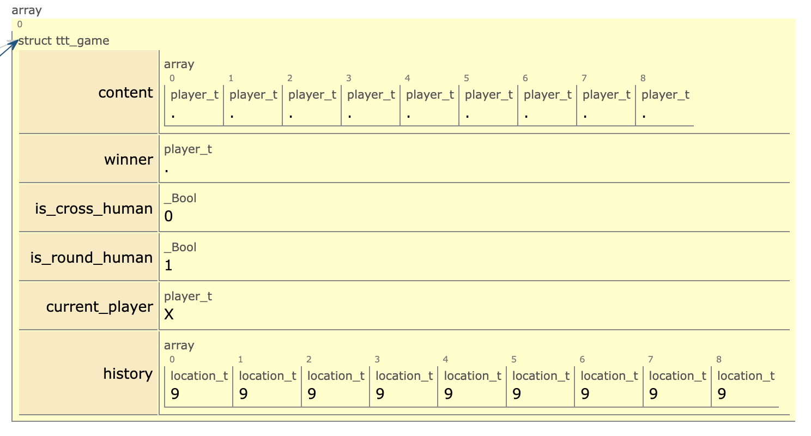

Pour compiler

-std=c99 : On force à utiliser a minima le standard c99
-Wall : On veut compiler en étant averti de tous les warnings
-o ttt : permet de générer l'exécutable ttt à partir des fichiers .o
-lncurses : permet de lier la librairie ncurses à l'exécutable (doit être positionné en fin de ligne de compilation)

 gcc -std=c99 -Wall tictactoe.c -o ttt -lncurses

 Pour lancer

 ./ttt
 Structure ttt_game in pythontutor

